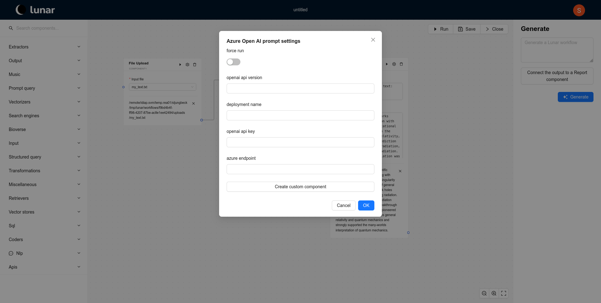
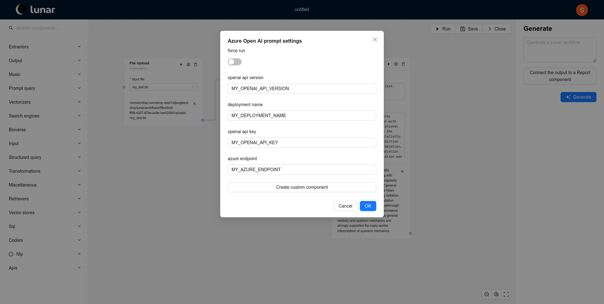

# Adding Your LLM API Key

In this guide, we will walk you through the process of adding an LLM API key to a component. You can do this either via the **LunarFlow** web interface or the **LunarCore** backend, depending on your preference and setup.

## Adding the API Key via the Web Interface

To add an API key to a component directly from the website, follow these steps:

1. **Open Workflow Editor**: Open the workflow containing the component. Alternatively, create a new workflow and add the component to it. In this example, we will show how to add an key to the *Azure Open AI prompt* component.
   

2. **Access Component Settings**: Click on the gear icon next to the component to open its settings.
   

3. **Enter the API Key**: In the settings panel, input the API key and any other required credentials for the component. Then, click on the `OK` button.
   

## Adding the API Key via the Backend

To set a default API key for all components and for the [co-pilot](copilot), you can configure it directly in the backend. Here is how:

1. **Locate the LunarCore Directory**: Open your **LunarCore** directory in your terminal or file explorer.

2. **Edit the `.env` File**: Open the `.env` file with your preferred text editor. If the file does not exist, create a new one and copy the content from the `[example].env` file provided by LunarCore.

3. **Add API Credentials**: Define the necessary environment variables by adding your API key and related credentials. For example, to set up OpenAI credentials, you would add:
    ```bash
    AZURE_ENDPOINT="MY_AZURE_ENDPOINT"
    OPENAI_API_KEY="MY_OPENAI_API_KEY"
    ```

4. **Restart LunarCore**: After saving the changes, restart **LunarCore** for the updates to take effect.

### Troubleshooting

If the component still does not recognize the API key after following these steps, check its source code to ensure it correctly references the environment variables for the API key.

---

By following these instructions, you can seamlessly add and manage your LLM API keys within LunarFlow or LunarCore, ensuring your workflows run smoothly.
