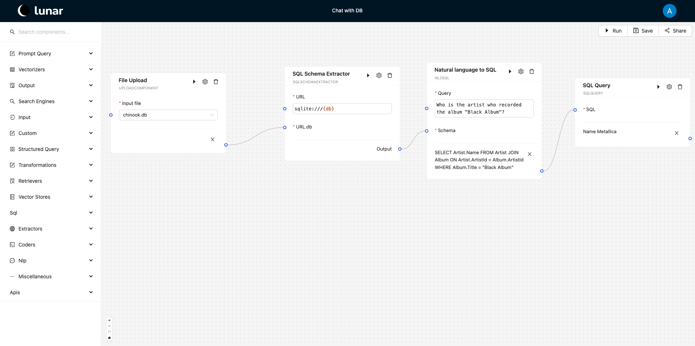

# Lunar components

Components are distinguishable units of work that when combined, create workflows. Components enable the encapsulation of workflow logic into observable units that can be reused across workflows and sub-workflows.

Components can encapsulate any discrete task in a process, from textual input or file reading operations, to field selection, database and API querying or more complex AI/ML models.

The following is a list of pre-defined Lunar components, together with their descriptions.

| Component name | Component description |
|---|---|
| Arxiv Extractor | Extracts titles, authors, and latex code from Arxiv papers. |
| Audio Player | Plays an audio file in base64 format. |
| Audio2Base64 | Converts an audio file to a base64 string. |
| Azure Open AI Prompt | Connects to Azure OpenAI's API, runs a natural language prompt, and outputs the generated text. |
| Azure Open AI Vectorizer | Encodes input texts as numerical vectors (embeddings) using Azure OpenAI models. Outputs embeddings for each input text. |
| Bar chart | Creates a bar chart visualization based on numerical data, useful for representing categorical data comparisons. |
| Bing Search | Searches data using the Bing Search API. Returns relevant search results. |
| CAUC | Converts CAUC data to SQL format. |
| CIViC | Searches the CIViC database for clinical variant data and gene information relevant to cancer. |
| Capag2sql | Converts CAPAG data to SQL format. |
| Causal Discovery Algorithms with a LLM | Runs causal discovery algorithms with the help of an LLM to apply different methods. Outputs include SEM object results and agent output. |
| Causal Graph Discovery with LLM | Runs causal graph discovery using an LLM and Wikipedia to identify causal relations between variables. Outputs include the causal graph and a log of the process. |
| Causal Inference with a LLM | Uses an LLM to run causal inference methods (DoWhy and CausalPy), generating results and a log of the step-by-step reasoning. |
| Causal Structural Equation Model Refinement with LLM | Uses SemoPy to refine and interpret an initial SEM with the help of an LLM. |
| CausalGraphViewer | Displays JSON serializable graph (node-link format). |
| Csv Upload | Reads a CSV file with a header and extracts the content for further analysis or use in other components. |
| Csv Viewer | Displays the contents of a CSV file for easy viewing, providing a structured and organized layout. |
| Csv2sql | Converts CSV data to SQL format. |
| Cytoscape Visualizer | Receives a Cytoscape formatted JSON and creates a graph visualization. |
| Elasticsearch client | Queries Elasticsearch for data, supporting advanced search and filtering operations. |
| Elasticsearch store | Stores structured data in an Elasticsearch instance for future retrieval and indexing, enabling search functionalities. |
| Emails Sender | Sends emails. |
| Excel2Text | Converts the content of an Excel file into plain text, enabling extraction and further manipulation of data. |
| File Upload | Uploads local files to the server. |
| Finance2sql | Converts finance data to SQL format. |
| Finance_api2sql | Converts finance data from API to SQL format. |
| Gemini AI prompt | Connects to Gemini’s API to run natural language prompts and retrieve AI-generated responses. |
| Gene Set Upload | Reads a CSV file containing gene data and outputs a list of gene names for downstream analysis. |
| GraphQL Query | Fetches data from a GraphQL endpoint. Outputs the response for the query in JSON format. |
| HTML Reports Builder | Generates custom HTML reports based on Jinja2 templates, allowing dynamic content rendering for web reports or dashboards. |
| Htmls2Texts | Converts HTML content into plain text, stripping away tags and retaining the meaningful text content. |
| HuggingFace vectorizer | Encodes texts into embeddings using HuggingFace models. Outputs the original text and corresponding embeddings. |
| Indra Network Assembler | Retrieves scientific literature relevant to a given set of genes, assisting in building gene interaction networks. |
| Inep2sql | Converts INEP data to SQL format. |
| JSON Input | Allows the input of a JSON text (potentially with template variables) that can then be used in other downstream components. It can also be used as an output if useful. |
| Kitai download | Downloads converted sound files using Kitai. |
| Kitai models | Retrieves available voice models from Kitai. |
| Kitai splitter | Splits sound files using Kitai. |
| Kitai splitter_download | Downloads split sound files using Kitai. |
| Kitai | Voice AI component for sound files and voice models. |
| LLM prompt | Connects to a language model API to process natural language prompts and returns text-based responses. |
| Latex Cleaner | Cleans up Latex codes by removing comments and expanding restatables. |
| Latex Statements Extractor | Extracts definitions, axioms, lemmas, theorems, and corollaries from Latex. |
| Latex2HTML | Converts Latex codes to HTML with Mathjax. |
| Line chart | Plots a line chart from numerical data. Outputs the chart as an encoded image and the original input data. |
| List Index Getter | Extracts elements at given indices from a list. |
| LlamaIndex Indexing | Indexes documents using Azure OpenAI models within LlamaIndex, allowing efficient document retrieval and query-based interaction. |
| LlamaIndex Querying | Queries data from an index built with LlamaIndex, supporting custom retrieval configurations and response formatting. |
| Lyrics Generator | Generates song lyrics from an inputted theme using Azure OpenAI's API. |
| Milvus Retriever | Retrieves embeddings from a Milvus server for similarity-based searches. |
| Milvus Vectorstore | Stores embeddings on a Milvus server. Outputs the number of stored embeddings. |
| NCI Thesaurus | Retrieves biomedical terminology and data from the NCI Thesaurus using SPARQL queries. |
| Natural language to SQL Query | Converts a natural language query into an SQL query based on a given data definition schema. Outputs the generated SQL query. |
| NeXtProt | Retrieves data from neXtProt, a comprehensive resource focused on human proteins, including their functions, localization, expression, interactions, and disease relevance. |
| Online Spreadsheet IO | Reads from and writes data to an online spreadsheet, supporting collaborative data management. |
| Online Spreadsheet | Downloads and retrieves the content from an online spreadsheet for further processing or analysis. |
| OpenAI prompt | Connects to OpenAI's API, runs natural language prompts, and outputs the result as text. |
| OpenAI vectorizer | Encodes text into vectors using OpenAI models for applications like search, clustering, and text analysis. |
| PDFExtractor | Extracts title, sections, references, tables, and text from PDF files. |
| PROGENy | Provides data on pathway-target gene interactions with weighted significance for each interaction. |
| Paper Database Builder | Builds a JSON with data of scientific papers. |
| Picture Extractor | Extracts text, including mathematical formulas, from images. Useful for digitizing content from photos or scanned documents. |
| Property Getter | Extracts the value of a specified key or attribute from an object or data structure, enabling easy access to nested properties. |
| Property Selector | Retrieves the values of specific properties (keys) from a dictionary. |
| Pubmed Searcher | Searches for biomedical literature on PubMed using keyword queries and filters for year and page length. |
| Python coder | Executes Python code and returns the result, allowing the use of custom Python scripts. |
| R coder | Executes R code and returns the result, enabling integration of R scripts into workflows. |
| Range | Generate a sequence of numbers, starting from 0 by default, and increments by 1 (by default), and stops before a specified number. |
| ReACT Agent | Implements ReACT logic, which combines reasoning and acting for enhanced decision-making. |
| Reaper Controller | Controls Reaper DAW by natural language commands. |
| Remf2sql | Converts REMF data to SQL format. |
| Report | Creates customizable reports from input data, allowing users to format and edit reports. |
| SBGN Visualizer | Visualizes biological pathways using the Systems Biology Graphical Notation (SBGN) standard. |
| SPARQL Query | Executes queries against SPARQL endpoints to retrieve structured data, typically from knowledge bases like Wikidata or the NCI Thesaurus. |
| SQL Query | Executes SQL queries against a database and retrieves the result, useful for extracting information from relational databases. |
| SQL Schema Extractor | Connects to a SQL database and retrieves its schema (Data Definition Language). Outputs a JSON describing the database schema. |
| Sidra2sql | Converts SIDRA data to SQL format. |
| Sleep | Delays execution for a set time. |
| Spacy NER | Performs Named Entity Recognition (NER) on text, identifying entities like persons, organizations, dates, and more using Spacy’s NLP framework. |
| Spleeter_deezer | Splits audio tracks into components using Spleeter. |
| Subworkflow | Selects and runs another workflow. |
| Suno Music Downloader | Downloads songs from Suno. |
| Suno Music Generator | Generates music using Suno. |
| Table2Text | Converts a CSV-formatted table into a text by generating sentences for each row, facilitating more natural readability of tabular data. |
| Text Input | Allows for user-provided text input, including template-based inputs for other components to use. |
| URLs Scraper | Scrapes a list of provided URLs for data. Returns content or errors for each URL in a structured dictionary. |
| UniProt | Fetches comprehensive protein sequence and functional data from the UniProt database. |
| WikiPathways | Fetches data from WikiPathways, an open-source platform for community-contributed biological pathways. |
| Wikidata client | Retrieves data from Wikidata API, returning knowledge/metadata for a given search term. Outputs relevant results in a structured format. |
| Wikipedia client | Retrieves data from Wikipedia API. |
| WolframAlpha client | Connects to the WolframAlpha API and retrieves computational or factual information based on the input query. |
| Yahoo Finance API | Connects to Yahoo's public API using yfinance and retrieves financial data about companies and their stocks. |
| Zip file extractor | Extracts files from a ZIP archive, returning the paths to the extracted files on the server. |

## Running components

Every component will include a run() function that defines the running behavior of the component. This behavior can be triggered by calling the run() function programmatically with a component instance (i.e., components are defined as Python objects) or by using the run button in the interface, as seen in the image below. At runtime, the component inputs are either provided by the user in the form of text inputs or data inputs (i.e., file upload) or received from downstream components - via in-edges, while the output is printed in the interface as seen below.

___
Inputs/output received/sent from/to downstream/upstream components requires data type compatibility. Generally, a component _A_ with output of type _T_ could only link to a component _B_ that expects an input of the same type _T_. The only exception to this type compatibility requirement is the case where _A_ outputs a _list_ of multiple instance of _T_. In such a case component _B_ will automatically run in a loop for every instance received from _A_.

## Data types

Lunar provides a set of data types for data validation between components in a workflow and ensures the correct visual representation of the data on the interface (Lunarflow)

| Name              | Primitive Type | Description                                                                            |
|-------------------|----------------|----------------------------------------------------------------------------------------|
| FILE              | File           | Represents a file                                                                      |
| TEXT              | str            | Represents text                                                                        |
| CSV               | str            | Represents CSV formatted text                                                          |
| INT               | int            | Represents an integer                                                                  |
| FLOAT             | float          | Represents a floating-point number                                                     |
| CODE              | str            | Represents Python code                                                                 |
| R_CODE            | str            | Represents R code                                                                      |
| EMBEDDINGS        | list           | Represents embeddings as a list of floats                                              |
| JSON              | dict           | Represents a JSON object                                                               |
| IMAGE             | str            | The base64 string representation of an image                                           |
| REPORT            | str            | Represents a report. Allows the creation of an editable rich text editor               |
| TEMPLATE          | str            | Represents a template with replaceable variables                                       |
| LIST              | list           | Represents a list                                                                      |
| AGGREGATED        | dict           | Only assignable to component inputs. Allows the input to receive multiple outputs as a dictionary |
| PROPERTY_SELECTOR | str            | Displays a property selector component on the interface                                |
| PROPERTY_GETTER   | str            | Displays a property getter component on the interface                                  |
| WORKFLOW          | dict           | Represents a workflow. Used to run workflows recursively                               |
| SQL               | str            | Represents an SQL query                                                                |
| GRAPHQL           | str            | Represents a GraphQL query                                                             |
| SPARQL            | str            | Represents a SPARQL query                                                              |
| PASSWORD          | str            | Represents a secret                                                                    |
| ANY               | any            | Any type                                                                               |

## Creating components

There are four main ways of creating new components and extending the Lunar Component Library:

1. Programmatically - this can serve well when Lunar is deployed locally. Creating a new component programmatically assumes familiarity with Python and Object Oriented Programming (OOP) concepts. Details can be consulted [here](./creating_a_new_component.mdx). Components defined programmatically are included in the component library and will be available to all users of the local system.
2. Web-programmatically - this is a version of the above that does not require local deployment. Components can be defined programmatically in the web interface provided by Lunar. The interface requires the definition of input/output types and the main function (i.e., `run()`) defining the component's functionality at the least. Components created web-programmatically will be available only to the defining user.
3. Via inheritance from other components - this only allows for specifying the configuration of an existing component and saving it for future re-use - the component functionality remains unchanged. nd the latter specified by the user before running the component. The new component will only be available to the creating user.
4. Via **\*Coder** components - these special component types allow the user to write the code defining the component's functionality. This is similar to 2. above, except for the input/output definitions - **\*Coder** components will allow arbitrary input types that are compatible with the underlying programming language. **\*Coder** components can be used in the current workflow or saved for future re-use by the same user, similar to variants 2. and 3. above. Currently **\*Coder** components can be defined using *Python* and *R*.