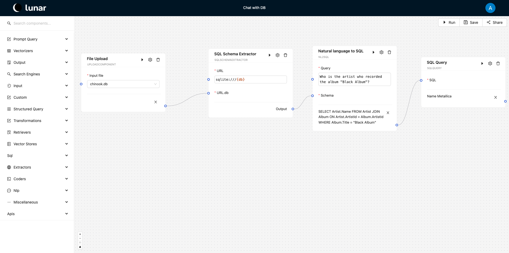

# Introduction

Components are the fundamental building blocks of workflows in the Lunar system. Each component represents a distinguishable unit of work that can be combined with other components to create complex workflows. By encapsulating specific tasks into reusable and observable units, components enable modular and maintainable workflow design.

Components can handle a wide range of tasks, from simple operations like reading text or files, to more complex processes such as database queries, API interactions, and advanced AI/ML model executions. This modular approach allows for flexibility and reusability, making it easier to construct and manage workflows.

Lunar have a wide range of first-party components tested and ready for you to use in your workflows. They encompass various functionalities, from data extraction and transformation to advanced machine learning and visualization. These components are designed to be easily integrated into your workflows, providing robust and reliable performance. 

## Running components

Every component in Lunar performs a pre-defined task encapsulated within an action. Each component includes a `run()` function that defines its execution behavior. This behavior can be triggered programmatically by calling the `run()` function on a component instance (i.e., components are defined as Python objects) or by using the run button in the interface, as seen in the image below.

At runtime, the component inputs are either provided by the user in the form of text inputs or data inputs (i.e., file upload) or received from downstream components - via in-edges, while the output is printed in the interface as seen below.

Inputs and outputs exchanged between components must be compatible in terms of data types. Generally, a component _A_ with an output of type _T_ can only link to a component _B_ that expects an input of the same type _T_. The only exception to this type compatibility requirement is when _A_ outputs a _list_ of multiple instances of _T_. In such cases, component _B_ will automatically run in a loop for each instance received from _A_.

## Data types

Lunar provides a set of data types for data validation between components in a workflow and ensures the correct visual representation of the data on the interface (Lunarflow)

| Name              | Primitive Type | Description                                                                            |
|-------------------|----------------|----------------------------------------------------------------------------------------|
| FILE              | File           | Represents a file                                                                      |
| TEXT              | str            | Represents text                                                                        |
| CSV               | str            | Represents CSV formatted text                                                          |
| INT               | int            | Represents an integer                                                                  |
| FLOAT             | float          | Represents a floating-point number                                                     |
| CODE              | str            | Represents Python code                                                                 |
| R_CODE            | str            | Represents R code                                                                      |
| EMBEDDINGS        | list           | Represents embeddings as a list of floats                                              |
| JSON              | dict           | Represents a JSON object                                                               |
| IMAGE             | str            | The base64 string representation of an image                                           |
| REPORT            | str            | Represents a report. Allows the creation of an editable rich text editor               |
| TEMPLATE          | str            | Represents a template with replaceable variables                                       |
| LIST              | list           | Represents a list                                                                      |
| AGGREGATED        | dict           | Only assignable to component inputs. Allows the input to receive multiple outputs as a dictionary |
| PROPERTY_SELECTOR | str            | Displays a property selector component on the interface                                |
| PROPERTY_GETTER   | str            | Displays a property getter component on the interface                                  |
| WORKFLOW          | dict           | Represents a workflow. Used to run workflows recursively                               |
| SQL               | str            | Represents an SQL query                                                                |
| GRAPHQL           | str            | Represents a GraphQL query                                                             |
| SPARQL            | str            | Represents a SPARQL query                                                              |
| PASSWORD          | str            | Represents a secret                                                                    |
| ANY               | any            | Any type                                                                               |

## Creating components

There are four main ways of creating new components and extending the Lunar Component Library:

1. Programmatically - this can serve well when Lunar is deployed locally. Creating a new component programmatically assumes familiarity with Python and Object Oriented Programming (OOP) concepts. Details can be consulted [here](./creating_a_new_component.mdx). Components defined programmatically are included in the component library and will be available to all users of the local system.
2. Web-programmatically - this is a version of the above that does not require local deployment. Components can be defined programmatically in the web interface provided by Lunar. The interface requires the definition of input/output types and the main function (i.e., `run()`) defining the component's functionality at the least. Components created web-programmatically will be available only to the defining user.
3. Via inheritance from other components - this only allows for specifying the configuration of an existing component and saving it for future re-use - the component functionality remains unchanged. nd the latter specified by the user before running the component. The new component will only be available to the creating user.
4. Via **\*Coder** components - these special component types allow the user to write the code defining the component's functionality. This is similar to 2. above, except for the input/output definitions - **\*Coder** components will allow arbitrary input types that are compatible with the underlying programming language. **\*Coder** components can be used in the current workflow or saved for future re-use by the same user, similar to variants 2. and 3. above. Currently **\*Coder** components can be defined using *Python* and *R*.