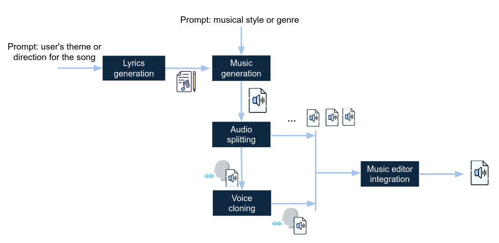

import ReactPlayer from 'react-player'

# AI-based Music Generation

## Motivation

Generative AI can provide magnitude-order productivity improvements for musical creativity, reducing the barriers for experimentation and editorial refinements. Currently, there are plenty of specialized AI-based services available which can support this process. However, putting these services to work, i.e. building an end-to-end music generation agent, requires users to coordinate across different APIs and the understanding of the capabilities and configuration parameters for each service. In this gallery example, Lunar was used to address this coordination effort.

## Workflow Overview

The goal of this workflow is to create an automated, AI-driven music production pipeline that allows users to generate, refine, and produce a complete song using distributed generative AI tools and APIs. The agent allows users to control this process in a stepwise manner, from lyrics generation to final production in REAPER.

There are different software and APIs which can address different parts of this task. Examples are Suno (supports the generation of songs, lyrics, etc), Udio/UdioWrapper (a Python package that enables the generation of music tracks using Udio's API through textual prompts),Lalal (audio splitting tool API/SDK), Audimee (Voice cloning API), REAPER API (final production tool).

The figure below shows an outline of the main workflow components:

**Lyrics Generation**  
Using **OpenAI's API**, users can generate lyrics based on a template:  
`"Write a song about [Theme] in a [Mood] mood, set in [Setting], including the following words/phrases: [Key Words]."`

- **Input**: User's theme or direction for the song.
- **Output**: Generated lyrics (text).

**Music Generation**  
This integrates with music generation APIs (e.g., **Udio**, **Suno**), allowing users to specify musical styles, tempo, instruments, etc.:  
`"Create a [Genre] song with a [Tempo] tempo, featuring [Instruments]."`

- **Input**: User's preferences and lyrics from the previous step.
- **Output**: Complete song in audio format.

**Audio Splitting**  
Using tools like **Lalal**, this step splits the generated song into separate vocal and instrumental tracks.

- **Input**: The complete audio file.
- **Output**: Separate vocal and instrumental tracks.

**Voice Cloning**  
By integrating with **Kits.ai**'s voice cloning API, users can select a professional singer's voice for the generated vocals.

- **Input**: Vocal track and the user-selected professional voice.
- **Output**: New vocal track with the cloned voice.

**Editor Integration**  
This step integrates with **REAPER** APIs, providing a prompt-based interface for editing and applying effects.

---

### Demonstration

Watch the video below to see what the workflow looks like and listen to the generated music.

<ReactPlayer playing controls url='/ai_music_workflow.webm' />

### Listen to the Generated Music

You can listen to the generated music directly in your browser or download it for offline use. Click the play button below to listen to the sample.

  <audio controls>
    <source src="/bird_music_workflow.mp3" type="audio/mpeg" />
    Your browser does not support the audio element.
  </audio>
  
<a href="/bird_music_workflow.mp3" download="bird_music_workflow.mp3">Download the audio file</a>

---

## Do It Yourself

You experiment with the workflow yourself by downloading it [here](/workflows/03a8f634-c290-41dc-ac79-e1c65bdd3325.json).

### Setting Up the Tools

To get started, follow the steps below to set up the required tools: **Suno**, **Kits.ai**, and **Reaper**.

### 1. Setting Up Suno

- **Create an Account**: Create an account on Suno [here](https://suno.com/).
- **Download Suno API Repo**: Download the Suno API repository from GitHub [here](https://github.com/gcui-art/suno-api).
- **Run Suno API**: Follow the README instructions to run the API locally.

### 2. Setting Up Kits.ai

- **Create an Account**: Create an account on Kits.ai [here](https://www.kits.ai/).
- **Upgrade to Premium**: Upgrade to the "Converter" tier for API access.
- **Get API Key**: Obtain your API key from Kits.ai.

### 3. Setting Up Reaper

- **Download REAPER**: Download the REAPER application [here](https://www.reaper.fm/).
- **Install REAPER**: Follow the installation instructions available on [PyPi](https://pypi.org/project/python-reapy/).
- **Open REAPER**: Once installed, open the REAPER application.

---

## Contributors

This workflow was developed by Matteo Sorci, Simon Ljungbeck, João Pedro Gandarela de Souza, André Freitas, and others as part of the **Lunar** project.
