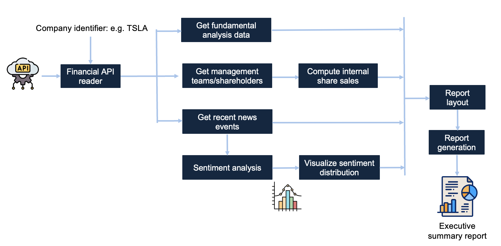

import ReactPlayer from 'react-player'

# Monitoring a Portfolio of Company Assets

## Motivation

This demonstration covers a simplified (educational) example of monitoring the latest events associated with a publicly traded company. An API connector is used to collect data from a specific company (recent news, management team), which is then semantically analyzed using LLMs (e.g., sentiment analysis), post-processed (generated visualizations), and all results are output into a report.

## One-Shot Reports

This demonstration showcases the concept of a *one-shot report*, where a generative AI expert agent performs various analytical tasks that are aggregated into a single report. Many analytical tasks aim to produce a document that builds an evidence/data-driven argument to support downstream decision-making. 

**Lunar** integrates this concept into its architecture, allowing the end-to-end organization of the analytical cycle from data source collection to communication of results. While some reports can be fully automated, Lunar users commonly treat one-shot reports as a first draft, which concentrates all relevant evidence into a single point of access and performs preliminary analytical processes.

## Workflow Overview

In this example workflow, the Yahoo Finance API is used to collect basic company data for a specified company. Given the stock identifier as an input parameter, the workflow starts by using an external finance API to collect fundamental, shareholder, management team and event data for a target company. News events are aggregated using an LLM-based sentiment analysis and then visualized into a barchart plot. Shares of the management team are computed and summarized. A final report is structured and made available to end users. The figure below outlines the main components.

### Demonstration

Watch the video below to see what the actual workflow looks like.

<ReactPlayer playing controls url='/building_a_one-shot_financial_report.mp4' />

---

## Contributors

This workflow was developed by Alex Bogatu.
