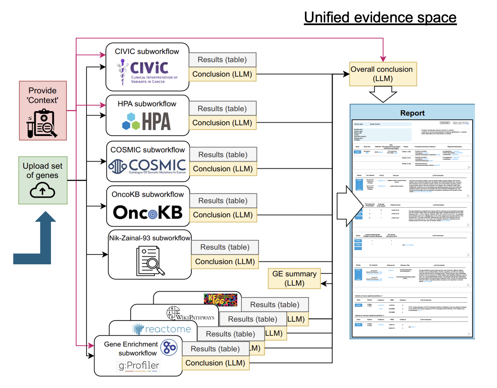

import ReactPlayer from 'react-player'

# Evidence Enrichment and Genomic Analysis in Cancer Research

## Motivation

Scientific practice in complex sciences, such as within the biomedical domain, implies the continuous interpretation of heterogeneous and distributed evidence. In oncology for example, while trying to explain the different patient responses to a certain treatment intervention, experts have access to a large set of highly curated resources, i.e. specialized databases with previous biological, pre-clinical and clinical evidence. These databases, however, conform to different data models (e.g. relational, graph), diverse schemas and can also be largely unstructured. Moreover, experts need to interpret the most recent available evidence, which is typically only available on scientific papers.

## Unified Evidence Spaces

The scenario above defines one of the analytical frontiers for evidence-based reasoning: given a context, reducing the barriers for accessing relevant facts from distributed and heterogeneous data sources and harmonizing them in a single space. This connects to two main conceptual foci of Lunar: (i) creating an expressive library of components for high quality knowledge sources and (ii) the idea of recurring returns, *code it once and use it forever*.

## The Workflow

This demonstration focuses on the use of Lunar for supporting the interpretation of heterogeneous and distributed evidence in oncology, where given a set of expressed genes in the context of a clinical trial intervention, Lunar enriches these genes with external evidence (e.g. pathway, associated tumor types) converging all evidence into a unified space.

One of the aims of this example workflow, is to explore the unique molecular characteristics of HER2-low breast cancer to determine if it constitutes a distinct category within breast cancer types, where the input genes are ERBB2, ESR1, PIK3CA, CBFB, SF3B. The report shows genomic alterations and genomic signatures that were identified, including ERBB2 amplification, mutations in PIK3CA and ESR1, which are important biomarkers in the selection of breast cancer treatment. For the remaining two genes, evidence was found confirming that these are new, significantly mutated genes for which there is preclinical evidence of actionability in clinical practice.

A second aim is to discover new genes that could lead to more accurate breast cancer diagnoses, enhancing treatment strategies and addressing the disease’s complexity. His numerical analysis resulted in a set of genes (DIXDC1, DUSP6, PDK4, CXCL12, IRF7, ITGA7, NEK2, NR3C1) that require investigation. The report informs that none of the genes is an oncogene (confirmation according to OncoKB), two of the genes are potential drug targets and one is FDA approved drug targets. According to the KEGG-based enrichment analysis, these genes were mainly enriched through several signaling pathways including tumor necrosis factor (TNF) signaling pathway. Using LLMs in conjunction with a PubMed search component, papers were searched in PubMed that describe various gene variants and the genes have been indicated as prospective biomarkers associated with breast cancer. Note that in this scenario, for genes lacking molecular profiles in the KB, a search in PubMed was conducted. This approach enables the workflow to automatically uncover and search for non-obvious and previously unknown relationships. A video of the full workflow is available below:

[Watch the Full Workflow at YouTube](https://www.youtube.com/watch?v=Hc6pAA_5Xu8)

---

## Contribtors

This gallery demonstration was developed by Wysocki et al., and the full supporting publication is accessible at:

Oskar Wysocki, Magdalena Wysocka, Danilo Carvalho, Alex Teodor Bogatu, Danilo Miranda Gusicuma, Maxime Delmas, Harriet Unsworth, André Freitas. *An LLM-based Knowledge Synthesis and Scientific Reasoning Framework for Biomedical Discovery*, Demonstration Track at ACL, 2024.
