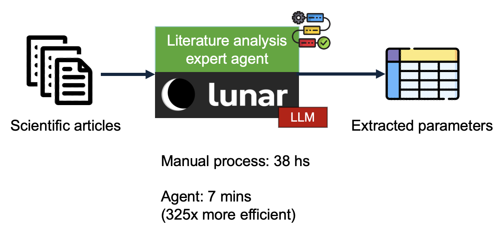
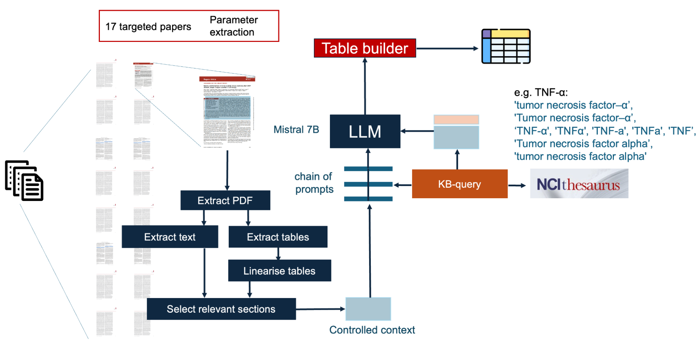

import ReactPlayer from 'react-player'

# Extracting Evidence from the Scientific Literature

## Motivation

Biomedical research contains a large corpus of quantitative evidence, which can inform new hypotheses and insights. However, making sense of this evidence is a time-consuming process and it commonly implies the manual curation effort of a domain expert. This demonstration covers an expert agent which performs a systematic literature analysis using Lunar, automatically extracting a table of specific parameters from a set of scientific articles. This workflow exemplifies the efficiency and scalability gains which can be achieved with the application of expert agents, where a process which took 38 hours to be delivered by manual expert curation was achieved in 7 mins by the agent (magnitude order efficiency gains).

## Building a Generative AI Expert System for Systematic Literature Review

In order to address such a task, the core textual interpretation/generation capabilities of LLMs need to be complemented by a set of complementary components, which will provide a *clean and controlled context* for the LLM to operate.

In this context, a clean and controlled context means that the source documents contain a complex original layout which needs to be processed by the LLM. A scientific article contains mainly interpretation bottlenecks which can largely impact the ability of LLMs to interpret its content:
- They are originally in a binary file (pdf).
- They are typically multi-page documents.
- They have a complex layout, with titles, sections, captions, tables and figures.
- This layout is heterogeneous across different articles.
- The target information is spread across text and tables.
- There are major terminological variations for the terms which we are interested in extracting (synonymic expressions, acronyms, etc).
- These are specialized terms.

In a real-world LLM setting, these factors need to be controlled in a robust way. The encapsulation of these robust control control mechanisms for a complex domain is part of the characterization that differentiates expert generative AI systems from Chatbot demonstrators.

## Workflow Overview

The figure below outlines the main components of the workflow. The workflow starts with components which parse a directory of files, extracting the structure of each pdf, identifying sections, textual/tabular content. Within the section structure, the workflow focuses on specific parts of the text (sections which cover results). Tabular content is linearized/factualized (i.e. transformed into natural language sentences). All these interventions aimed at providing a focussed, structurally clean context for the model.

This context is then augmented with the domain-specific information required for the model to have a robust interpretation of the target mentions (in this example, cytokine mentions). Cytokines are substances which are involved in the regulation of the immune system, and there are significant terminological variations in the way they are expressed (e.g. TNF-α: 'tumor necrosis factor–α’, 'Tumor necrosis factor–α’,‘TNF-α', 'TNFα', 'TNF-a', 'TNFa', 'TNF’, 'Tumor necrosis factor alpha’, 'tumor necrosis factor alpha'). This background knowledge needs to be added to the context of the prompt. In this workflow, we use a Lunar component which accesses the NCI thesaurus to get this additional contextual information.

With a selected and harmonized context, which contains all the specific background knowledge required, we are ready to prompt the LLMs. Please note that in order to not overload the model with a large context (thus losing control), cytokines are analyzed one at a time for every analyzed article, with prompts to detect the presence of a mention. Finally, the results are aggregated into a CSV file. The video below, shows the construction of the full workflow in Lunar.

<ReactPlayer playing controls url='/biomarker_lit_review_lunarverse_demo.mp4' />

---

## Contributors

This workflow was developed by Oskar Wysocki, Magdalena Wysocka, Danilo Carvalho, Alex Bogatu, and Andre Freitas.
