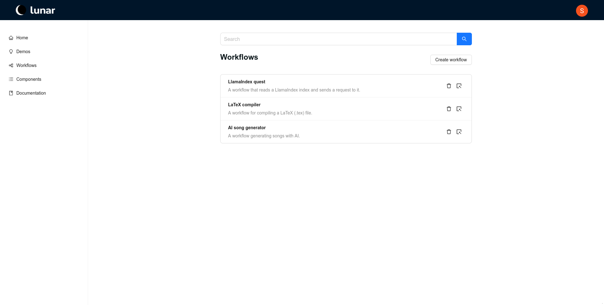

# Hello Lunar

Welcome to the **Lunar** platform! This guide will help you navigate and utilize the main features of the Lunar website.

When you visit the Lunar website, the first page you will see is the **Home Page**, which serves as your central hub for accessing workflows and components.

## Lunar Home Page

At the center of the home page, you will find:
- **Recent Workflows**: A list displaying your most recently created workflows.
- **Component Library**: A list of components from the library, including both core components and any custom ones you have created.

From this page, you can also start building new workflows in two simple ways:
1. **Manually Create**: Click the `Create workflow` button to manually start building a new workflow from scratch.
2. **Co-pilot Assistance**: Use the co-pilot feature by entering a brief description of the workflow you would like to create into the text field next to the `Generate` button. Then click `Generate`, and Lunar will create the workflow for you.

## Navigation Bar

Located on the left side of the home page, the navigation bar allows you to explore different sections of the website:

- **Home**: Brings you back to the main landing page.
  
- **Demo**: Displays example workflows, providing inspiration and guidance on using Lunar's features.
  
- **Workflows**: This section contains a complete list of all your workflows. You can view, edit, or create new workflows directly from this page.
  
  
- **Components**: This page shows all available components, including both core and custom components. From here, you can create new custom components to extend the functionality of your workflows.
  

## Conclusion

You should now be familiar with the basics of Lunar and now how to navigate on the website. Click on the arrow below to the right to continue to the next Lunar tutorial page.