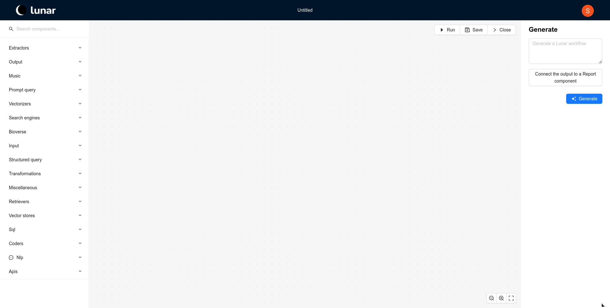
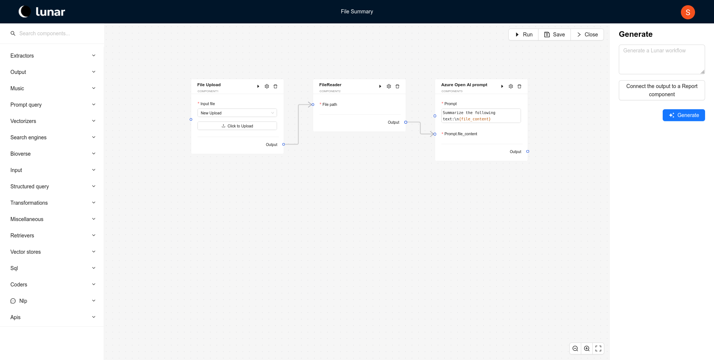
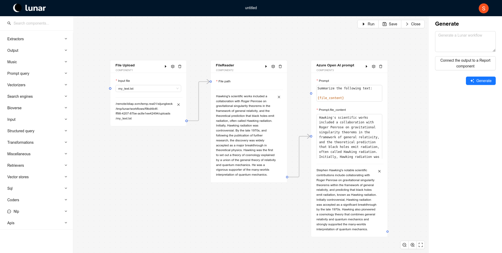
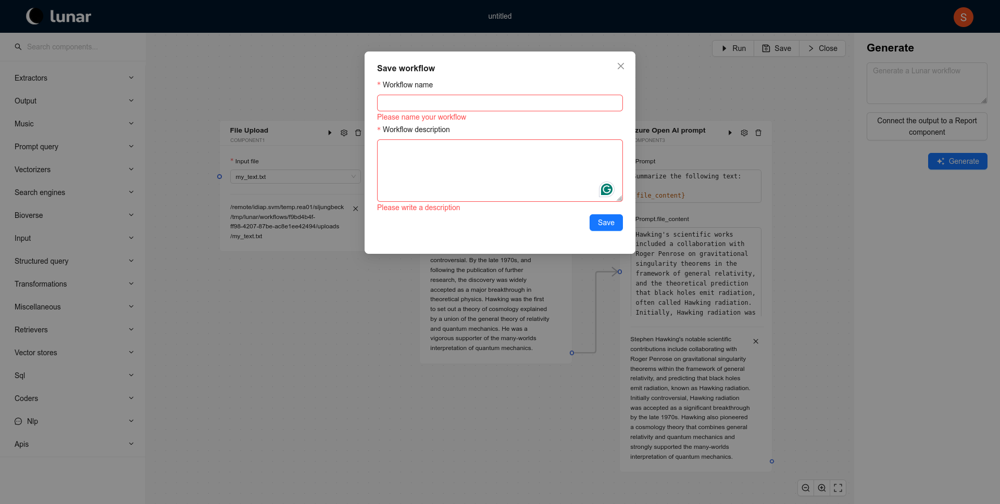

import ReactPlayer from 'react-player'

# My First Workflow

In this guide, we will walk you through the process of manually creating a workflow in Lunar. By following the steps below, you will learn how to compose, run, and save workflows. At the end of this guide, you will find a video that demonstrates each step.

<!-- To learn how to create workflows using the co-pilot feature instead, visit the [Workflow Co-piloting](copilot.md) page. -->

## Steps to Manually Create a Workflow

### 1. **Create an Empty Workflow**
   - From either the **Home** or **Workflows** page, click the `Create workflow` button. This action opens the workflow editor with an empty canvas where you can start building your workflow.
   <!--  -->
   

### 2. **Compose Your Workflow with Components**
   - Browse through the different component groups on the left panel to find the components you need.
   - Click and drag the desired component from the library into the workflow editor.
   - To connect the components, drag from the small circles next to the input/output areas of the components to establish the workflow’s logic.
   - If a component’s output is only part of another component's input, you can use template variables. Below is an example showing how the *Azure Open AI prompt* component utilizes a template variable called *file_content*.
   

### 3. **Run the Workflow**
   - Once your workflow is composed, click the `Run` button in the upper right corner of the editor to execute the workflow and see the results.
   

### 4. **Save the Workflow**
   - After running the workflow, click the `Save` button in the upper right to preserve your work.
   - Provide a meaningful title and description, then click `Save` to store the workflow for future use.
   

## Video Walkthrough

For a visual demonstration of these steps, watch the video below:

<ReactPlayer playing controls url='/simple_workflow.webm' />

## Download Example Workflow

<!-- Download the example workflow above [here](./workflows/f9bd4b4f-ff98-4207-87be-ac8e1ee42494.json) -->
Download the example workflow used in this tutorial <a href="./workflows/f9bd4b4f-ff98-4207-87be-ac8e1ee42494.json" download>here</a>.

## Conclusion

By following these steps and using the video tutorial, you should now be able to create, run, and save workflows in Lunar with ease. If you want to explore more advanced features or learn how to use the co-pilot, be sure to check out our [Workflow Co-piloting](copilot) guide.
